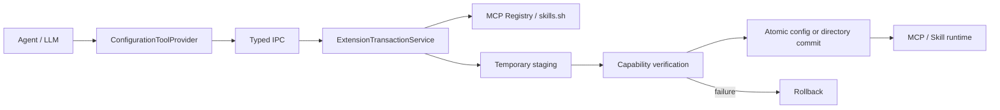

# Agent 扩展配置架构

本文定义 Adnify Agent 自主发现、规划、安装和验证 MCP/Skill 的安全边界。目标不是给模型一个通用 Shell，而是提供少量、可审计的语义工具。

## 1. 运行链路



渲染进程只能传递搜索条件、扩展来源和不透明的 `changeSetId`。解析后的命令、仓库 URL、配置和目标路径保留在主进程内存中，不返回给模型作为可编辑参数。

## 2. 工具契约

| 工具 | 是否修改系统 | 审批 |
| --- | --- | --- |
| `extension_list` | 否 | 无 |
| `extension_history` | 否 | 无 |
| `extension_search` | 否 | 无 |
| `extension_prepare` | 仅创建 10 分钟有效的内存变更单 | 无 |
| `extension_apply` | 安装并验证扩展 | 必须，且绑定单一 `changeSetId` |
| `extension_verify` | 否 | 无 |

隐藏子 Agent 与 Plan 的非执行阶段只暴露搜索和验证工具。只有前台执行 Agent 可以准备和应用变更。

## 3. 事务状态

```text
prepared -> applying -> committed
    |           |
    |           +-> rolled_back
    |           +-> failed (rollback also failed)
    +-> expired
```

- 变更单只能应用一次，防止审批重放。
- 审批凭证的 scope 为 `extension-change:<changeSetId>`，错配或超过两分钟即拒绝。
- MCP 先使用临时客户端完成连接和能力读取，再原子写入配置。
- Skill 在临时目录克隆，固定并复核 Git commit，拒绝符号链接，验证 `SKILL.md` 后通过同盘重命名提交。
- 提交后验证失败会删除本次新增内容；不会覆盖已有同名扩展。
- 需要密钥的 MCP 配置只保存 `${ADNIFY_SECRET:引用}` 标记。用户在 MCP 设置页录入后由操作系统加密，只有主进程启动 MCP 时才能解密。
- 事务事件追加写入用户配置目录下的 `audit/extension-events.jsonl`；事件不包含密钥或内部解析后的 payload。

## 4. 当前边界与后续演进

当前版本只支持“从官方 MCP Registry 安装”和“从 skills.sh 的 GitHub 来源安装”。Agent 不接触明文密钥；缺少凭据时会暂停应用，等待用户在 MCP 设置页完成安全录入。

下一阶段按以下顺序演进：

1. 持久化未完成的变更单，并在审计事件中补充审批主体和版本化 schema。
2. 扩展 `update`、`disable`、`remove` 动作，并为已有内容生成可恢复快照。
3. 将 Agent loop 从 renderer 移到 Electron utility process，使模型运行时与 UI 生命周期解耦。
4. 引入来源签名、发布者信任和组织策略，支持企业级允许/拒绝列表。
